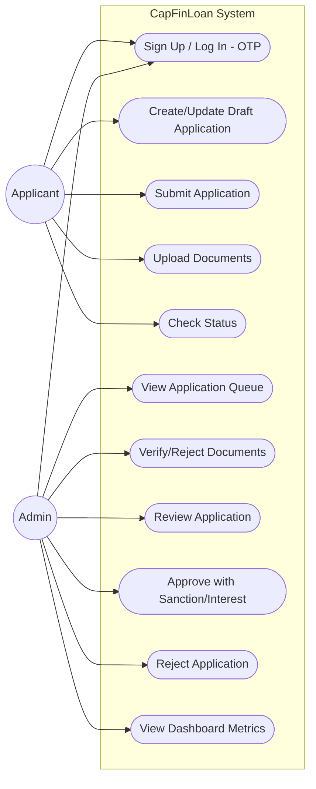
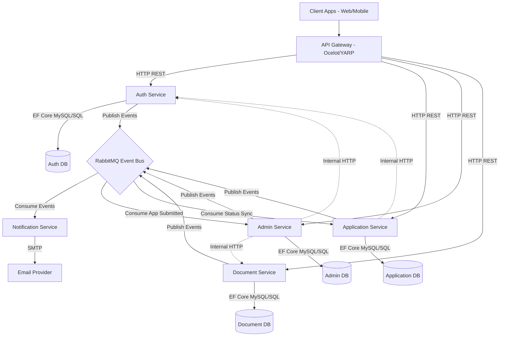
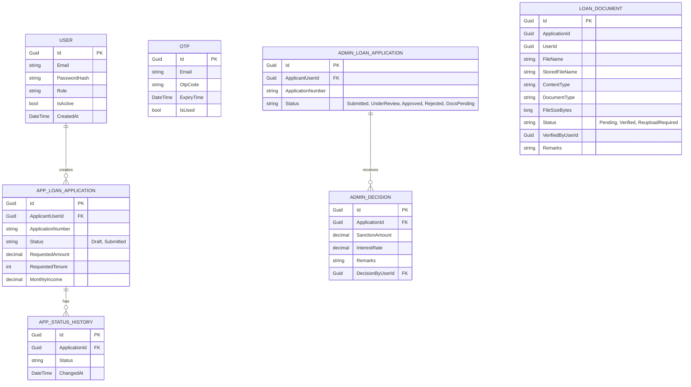

# CapFinLoan System Design Document

This document outlines the high-level architecture, use cases, database models, and low-level design patterns implemented in the CapFinLoan microservices ecosystem.

---

## 1. Use Case Diagram

This diagram maps out the primary actors (Applicant and Admin) and their interactions with the system capabilities.

---

## 2. Microservices Architecture Diagram

This flowchart visualizes the topological layout of the microservices, showing how external requests arrive through an API Gateway, and how services communicate via HTTP (synchronous) or RabbitMQ (asynchronous).

---

## 3. Database Entity Relationship (ER) Diagram

Since this is a microservices architecture, tables are logically separated by domain. Note the Data Duplication (Data Syncing) strategy between `ApplicationService` and `AdminService`.

---

## 4. Low Level Design (LLD) Document

### 4.1 Architecture Pattern: Clean Architecture + CQRS Lite
Each microservice is strictly divided into concentric layers to ensure separation of concerns:
* **API Layer**: Controllers, Middlewares (Global Exception Handler), and DI bootstrapping (`Program.cs`). Contains zero business logic.
* **Application Layer**: Contains Service Interfaces, DTOs (Contracts), and core Business Logic Services (`*Service.cs`).
* **Domain Layer**: Contains aggregate roots (Entities) and custom exception classes. Contains zero references to external libraries or databases.
* **Infrastructure Layer**: Contains `RabbitMQ` message publishers, `HttpClient` proxies, and `SMTP` implementations.
* **Persistence Layer**: EF Core `DbContext`, Migrations, and standard `IRepository` implementations.

### 4.2 Distributed Data Management Strategy
* **Database-per-Service**: Each service owns its schema. `ApplicationService` handles the early lifecycle (Draft to Submit). `AdminService` handles the late lifecycle.
* **Saga Pattern (Choreography)**: 
  * Instead of a central orchestrator, services react to Domain Events.
  * *Sync Scenario*: When `ApplicationService` pushes status to `Submitted`, it emits `ApplicationSubmittedEvent`. `AdminService` natively consumes this to project a replica of the application.
  * *Compensating Transaction Scenario*: If an Admin pushes status to `Approved`, `AdminService` emits `ApplicationStatusChangedEvent`. If `ApplicationService` fails to sync this status update in its own DB, it emits a `StatusSyncFailedEvent`. `AdminService` listens to this failure and rolls back the `Admin_Loan_Application` state and records a rollback remark.

### 4.3 Security & Resiliency
* **Authentication**: Centralized JWT issuance via `AuthService`. Standard `[Authorize]` attributes validate tokens across all microservices using a shared symmetric key injected via AppSettings.
* **Global Exception Handling**: All API services use a uniformly registered `GlobalExceptionHandlerMiddleware` which traps common custom exceptions (`InvalidOperationException`, `KeyNotFoundException`) and maps them to HTTP 400 and 404 responses respectively. This eliminates redundant `try/catch` blocs inside API Controllers.
* **Inter-Service Communication**: Restricted via `Internal` namespacing on routes. Some endpoints require a local bypass API Key (e.g., `X-Internal-Api-Key` headers) to prevent exposed exposure.

### 4.4 Unit Testing & Quality Assurance
* **Pattern**: Arrange-Act-Assert explicitly enforced. Mocking performed using `Moq`. Validation using `FluentAssertions`.
* **Testing Scope**: Tests target the `Application Layer` to test rigorous business boundaries (e.g., verifying `DocumentService` rejects >5MB files). Repositories and `HttpClient`s are fully mocked to prevent network/IO dependence.
* **Teardown Maintenance**: Handlers utilizing `IDisposable` (like `HttpClient` used in tests) are rigorously disposed in NUnit `[TearDown]` lifecycle attributes.
